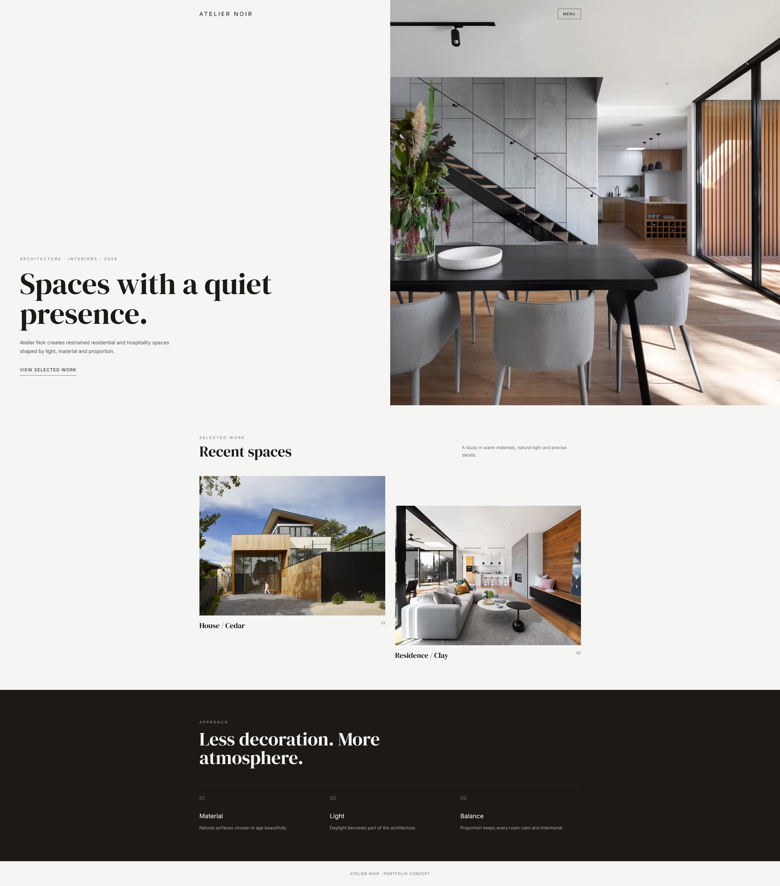
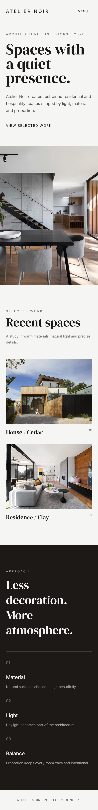

# Atelier Noir — Architecture Studio

A minimalist and elegant website concept for a modern architecture studio.

## Preview

### Mobile Preview

## Live Demo

[View Live Demo](https://Bmax13.github.io/atelier-noir-architecture/)

## About the Project

Atelier Noir is a premium architecture studio website concept focused on minimalism, typography and visual presentation.

The design uses a clean layout and large architectural imagery to create a sophisticated digital presence for an architecture brand.

## Features

* Responsive architecture studio website
* Minimalist visual design
* Large image-based sections
* Project showcase
* Studio information section
* Responsive navigation
* Mobile-friendly layout
* Smooth interactive elements

## Technologies

* HTML5
* Tailwind CSS
* JavaScript
* Responsive Design

## Purpose

This project was created as a frontend portfolio project to demonstrate the implementation of a premium, image-focused website with a strong emphasis on layout, typography and responsive design.
